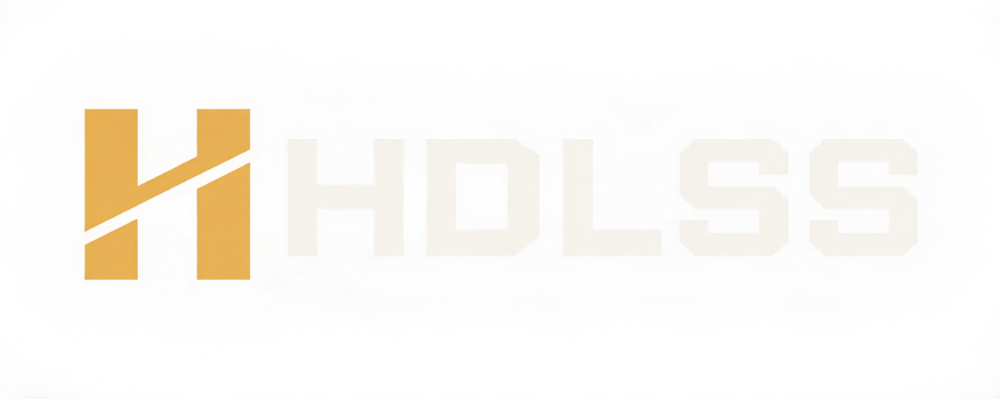
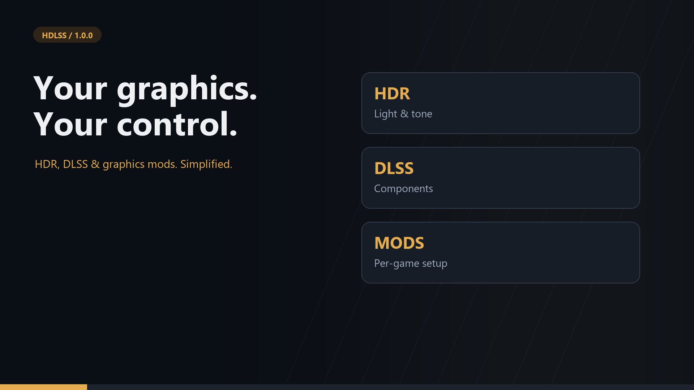
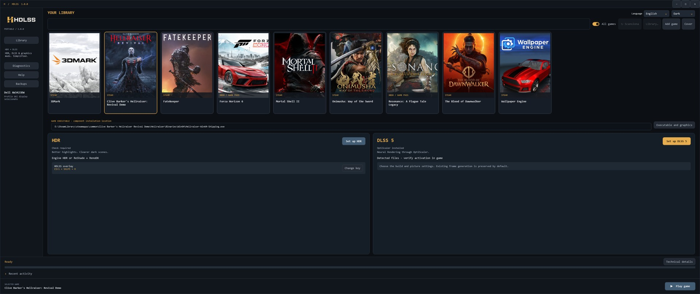
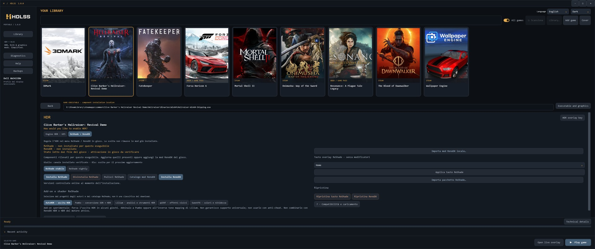
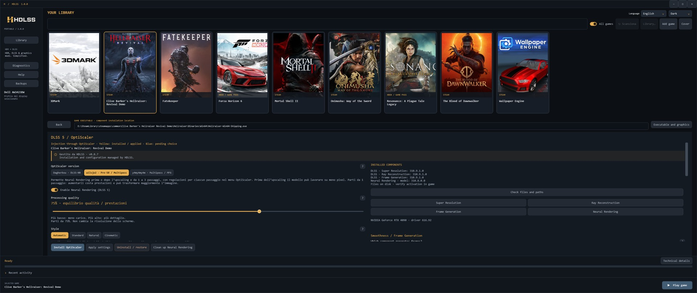

# HDLSS

**DLSS 5 & Neural Rendering for compatible games.**

[Download HDLSS 1.0.2](https://github.com/giorgiobascialla-hub/Ourze/releases/tag/v1.0.2) · [Release assets and presentation](https://github.com/giorgiobascialla-hub/Ourze/releases/tag/v1.0.0)

HDLSS was created to help configure DLSS 5 and Neural Rendering in compatible games. It brings supported community OptiScaler builds, component checks, backups and recovery into a portable Windows app, with additional HDR tools. It is an independent project; the integrated community injector builds are not official NVIDIA releases.



[](https://github.com/giorgiobascialla-hub/Ourze/releases/download/v1.0.0/HDLSS-Presentation.mp4)

## App screenshots

### Game library


### HDR settings


### DLSS components


## Changes in 1.0.2

Added official UE4SS installation and native DLSS discovery for manually added Unreal games. Native UE5 HDR now writes only INI files and requires no ReShade or RenoDX. Live pixel luminance and optional engine telemetry share one overlay with sample timestamps. In-game HDR validation remains pending. See the [changelog](CHANGELOG.md).

## What you can do

- Browse detected Steam and Xbox / Game Pass titles, or add a game executable.
- Configure supported Unreal HDR settings and manage ReShade / RenoDX separately.
- Work with the three supported community OptiScaler forks and their available options.
- Inspect Super Resolution, Ray Reconstruction and Frame Generation DLLs independently from the Neural Rendering model.
- Compare files across game folders, inspect their paths, and update a selected component with verification and backup.
- Restore supported managed installations and inspect the activity log.
- Choose English, Italian, Spanish, French, German or Portuguese. Some legacy technical messages remain untranslated.

## Start

Extract the portable archive into a writable folder and launch `HDLSS.exe`. Windows x64 and .NET Framework 4.8 are required. No Python or developer SDK is needed to run it.

Select a game, check the executable, then choose HDR or DLSS 5. Close the game before applying changes. The review step shows what will change before installation.

## Updating an existing installation

Close HDLSS and replace the executable with the new build. Keep `data`, any `data-location.txt`, and all existing backups. Legacy HDR Unlock component records remain supported. Do not delete the old data directory when a data-location link points to it.

## Why are there multiple DLL locations?

A game can ship the same component in an engine/plugin folder and beside its executable. HDLSS compares their SHA-256 hashes and distinguishes identical files, different files and unreadable comparisons. Use **Check files and paths** to refresh the inventory. It does not automatically delete duplicates or claim that every detected file is loaded.

## Compatibility

Features depend on the game, GPU, driver, display and selected component. Updating a DLL does not add a feature the game does not implement. Installed files do not prove an effect is active: verify the result in game. Protected installations may prevent modifications. Experimental community features are identified in the app.

This release is version 1.0.2. Broad hardware certification and complete localization remain in progress. See [validation](docs/VALIDATION.md) and [release notes](docs/RELEASE-NOTES.md).

## Build from source

On Windows with the .NET Framework compiler installed:

```powershell
New-Item -ItemType Directory -Force dist | Out-Null
powershell -ExecutionPolicy Bypass -File ./src/build.ps1 -Output ./dist/HDLSS.exe
```

## Support development

If HDLSS is useful to you, you can support its development with an optional [donation via PayPal](https://paypal.me/Ourze). Thank you for your support!

## Support

Include the app version, Windows version, GPU/driver, game and selected component. Describe expected and actual behavior. Review logs before sharing them and remove personal paths or other private data. Never upload game files, saved games or your backup directory to an issue.

## Credits and licensing

HDLSS is independent and is not affiliated with NVIDIA, Valve, Microsoft, Epic Games, ReShade, RenoDX or the OptiScaler authors. Component downloads retain their authors' terms. See [component sources](docs/SOURCES.txt). Third-party injectors, models and game files are not bundled.

No open-source license has been selected for HDLSS in this package. Public source availability alone does not grant a reuse license. Third-party trademarks and game artwork belong to their respective owners.


